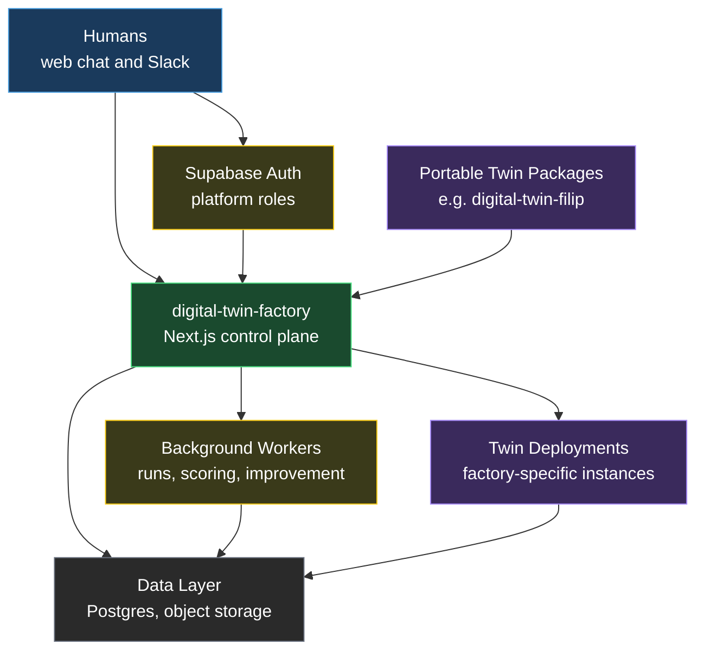
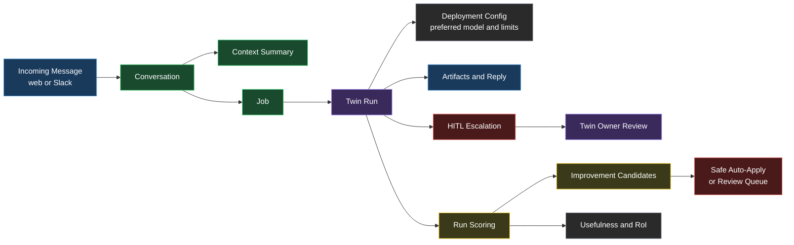
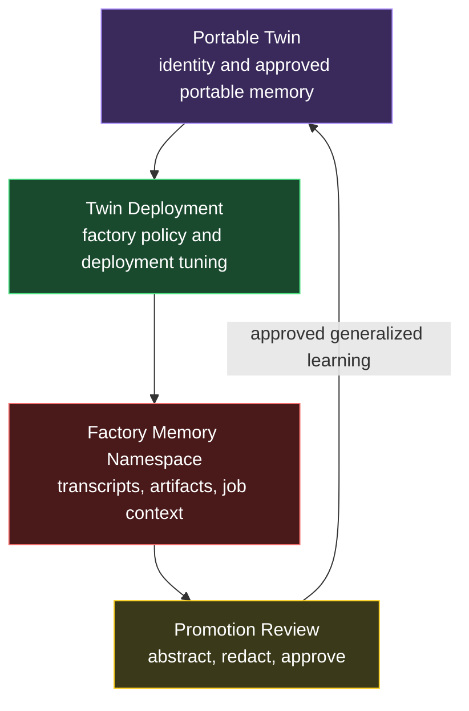

# Architecture

## Purpose

Describe the v1 architecture for `digital-twin-factory` and keep the visual model aligned with the implementation contracts.

## System Context

<!-- DIAGRAM: factory-system-context START -->

<!-- DIAGRAM: factory-system-context END -->

## Runtime Flow

<!-- DIAGRAM: factory-runtime-flow START -->

<!-- DIAGRAM: factory-runtime-flow END -->

## Memory Boundaries

<!-- DIAGRAM: factory-memory-boundaries START -->

<!-- DIAGRAM: factory-memory-boundaries END -->

## HITL Handoff

```mermaid
graph LR
    CHAT["Conversation
captured as messages"] --> SCORE["Run and Context Analysis"]
    SCORE --> ESC["HITL Escalation Trigger"]
    ESC --> SYN["Conversation Summary
open questions and next steps"]
    SYN --> DASH["Dashboard Handoff"]
    SYN --> SLACK["Slack or Email Notification"]
    ESC --> AUDIT["Escalation State
 open, resolved, cancelled"]
    DASH --> HUMAN["Real Human Behind Twin"]
    SLACK --> HUMAN
    HUMAN --> RESP["Decision or Follow-Up"]
    RESP --> LEARN["Learning Signal
for future improvement"]
    RESP --> AUDIT

    style CHAT fill:#1a3a5c,color:#fff,stroke:#4a9ede
    style SCORE fill:#3a3a1a,color:#fff,stroke:#facc15
    style ESC fill:#4a1a1a,color:#fff,stroke:#f87171
    style SYN fill:#1a4a2e,color:#fff,stroke:#4ade80
    style DASH fill:#1a3a5c,color:#fff,stroke:#4a9ede
    style SLACK fill:#1a3a5c,color:#fff,stroke:#4a9ede
    style AUDIT fill:#2a2a2a,color:#fff,stroke:#6b7280
    style HUMAN fill:#3a2a5c,color:#fff,stroke:#a78bfa
    style RESP fill:#3a2a5c,color:#fff,stroke:#a78bfa
    style LEARN fill:#2a2a2a,color:#fff,stroke:#6b7280
```

<!-- DIAGRAM: factory-hitl-handoff START -->

<!-- DIAGRAM: factory-hitl-handoff END -->

## Narrative Summary

The control plane is a `Next.js` application backed by Supabase Postgres, object storage, and background workers.

Key responsibilities:

- import portable twin packages
- create and manage factory-specific twin deployments
- persist deployment runtime config including preferred provider/model and fallback model
- enforce Supabase-authenticated super-admin and twin-owner access
- bootstrap the first `super_admin` through a secret-protected control path
- manage cookie-based operator sessions for the web control plane
- handle human-facing chat interactions
- normalize interactions into conversations, jobs, runs, and artifacts
- enforce policy, budgets, and analysis-only constraints
- synthesize conversation handoff packets when human intervention is required
- let the owner resolve or cancel HITL escalations directly from the dashboard
- run safe deployment-local self-improvement loops
- track usefulness and rate of improvement over time

## Core Components

- `app/`: future control plane UI and API routes
- `prisma/schema.prisma`: relational data model draft
- `supabase/schema.sql`: runtime persistence schema for the first backend slice
- `schemas/`: machine-readable contract definitions
- `scripts/`: repo maintenance utilities
- `diagrams/`: source-of-truth Mermaid diagrams

## Related Operational Docs

- `docs/evaluation-plan.md`
- `docs/continuous-monitoring.md`

## Update Rule

When the architecture changes:

1. update the relevant diagram source in `diagrams/`
2. run `python3 scripts/embed_diagrams.py`
3. update any affected docs and schemas
