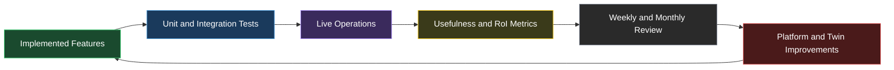

# Evaluation Plan

## Purpose

Define how to evaluate whether `digital-twin-factory` is meeting the original design goals in code and in operation over time.

## Evaluation Loop

<!-- DIAGRAM: factory-evaluation-loop START -->

<!-- DIAGRAM: factory-evaluation-loop END -->

## Evaluation Scope

Evaluate the system at three layers:

1. `implementation`
2. `workflow behavior`
3. `operational outcomes over time`

## Core Questions

- does the platform correctly capture conversations, messages, runs, summaries, and HITL escalations?
- do super-admin and twin-owner access boundaries work correctly?
- does HITL handoff reduce re-explaining and support better human follow-up?
- are digital twins useful?
- is usefulness improving over time?
- is the factory operating reliably enough to trust?

## Evaluation Matrix

| Area | Goal | Example Metric | Target |
|---|---|---|---|
| Persistence | Data captured correctly | conversation/message integrity | 100% |
| Access Control | Boundaries enforced | unauthorized access blocked | 100% |
| HITL | Handoff is sufficient | handoff packet sufficiency | >80% |
| Usefulness | Twin helps requesters | usefulness_score | rising after baseline |
| RoI | Twin improves over time | weekly_roi_delta | positive early trend |
| Reliability | Platform remains stable | notification failure rate | <5% |

## Test Layers

### Unit Tests

Verify:

- summary synthesis
- escalation creation
- dashboard aggregation
- auth token extraction
- deployment access decisions

### API Integration Tests

Verify:

- twin owner can access owned deployment data
- twin owner cannot access foreign deployment data
- super admin can access all deployments
- conversation -> run -> escalation -> notify flow works end to end

### Workflow Acceptance Tests

Run scenario-based checks:

- user asks a twin for review
- twin responds normally
- twin escalates when human judgment is required
- human receives a usable summary in dashboard or Slack
- resolution is captured and can be learned from later

### Operational Evaluation

Measure over weekly and monthly windows:

- usefulness_score
- useful_completion_rate
- clarification burden
- correction burden
- escalation rate
- repeat requester rate
- response latency
- budget per useful completion

## Acceptance Criteria For V1

V1 is meeting intent when:

- conversations and HITL state are captured reliably
- access control matches the super-admin / twin-owner model
- handoff summaries are sufficient for human follow-up
- usefulness trends upward after baseline formation
- RoI reporting is visible and interpretable
- no cross-deployment data leakage is observed

## Review Cadence

### Daily

- review failed runs and failed notifications
- review unusual escalation spikes
- review access anomalies

### Weekly

- review usefulness trend
- review rate-of-improvement trend
- review top escalation reasons
- review auth anomalies

### Monthly

- classify each deployment curve
- compare intended behavior vs actual behavior
- decide whether each deployment is healthy, stalled, or regressing
